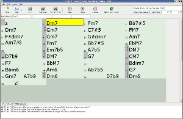



**As of May 26, 2021, LinuxBand project is no longer supported, please consider using [JJazzLab-X](https://github.com/jjazzboss/JJazzLab-X) instead. This linuxband.org site will be removed by Feb 8, 2024. LinuxBand project repository on GitHub will remain.**

LinuxBand is a GUI front-end for <a href="http://www.mellowood.ca/mma/">MMA (Musical MIDI Accompaniment)</a>. Type in the chords, choose the groove and LinuxBand will play a musical accompaniment for you. It's an open source alternative to Band-in-a-Box featuring:
<ul>
  <li>Easy to use graphical interface</li>
  <li>Open and well-documented data format</li>
  <li>Output to <a href="http://jackaudio.org">JACK Midi</a> to facilitate co-operation with other audio applications</li>
</ul>
After creating some simple songs with LinuxBand I recommend you to have a look at the <a href="http://www.mellowood.ca/mma/downloads.html">MMA's excellent manual</a>. LinuxBand has been designed in a way that allows you editing the song using Chord sheet view and MMA editor at the same time. It other words, LinuxBand will not break the formatting of your MMA files.

You can use LinuxBand to quickly sketch the chord changes you will improvise over. Connect the LinuxBand to <a href="http://ardour.org/">Ardour</a> digital audio workstation or other audio recorder to record your playing in sync. Download the archive containing jazz standards, country and Latin songs from <a href="http://www.mellowood.ca/mma/examples.html">MMA examples page</a>.

Available for Linux. Current release <a href="downloads.html">LinuxBand 12.02 Beta</a> ({{ "12-02-2012" | date: "%B %e, %Y" }}).

LinuxBand is free software, distributed under the terms of the <a href="http://www.gnu.org/copyleft/gpl.html">GNU General Public License</a> (GPL)
version 2 or later.

## Latest News




<!--
## Archive
<ul class="posts">
  
    <li>{{ post.date | date_to_string }} &raquo; <a href="{{ BASE_PATH }}{{ post.url }}">{{ post.title }}</a></li>
  
</ul>
-->
